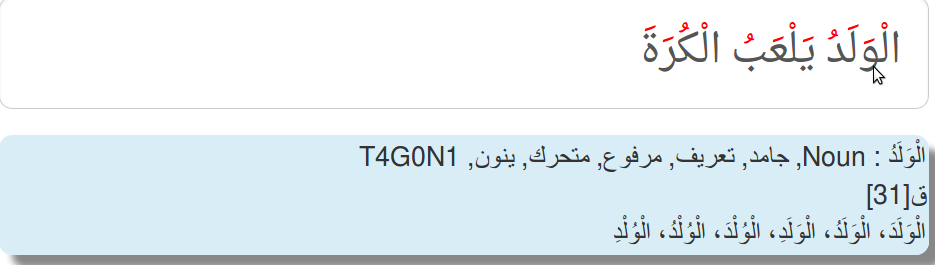
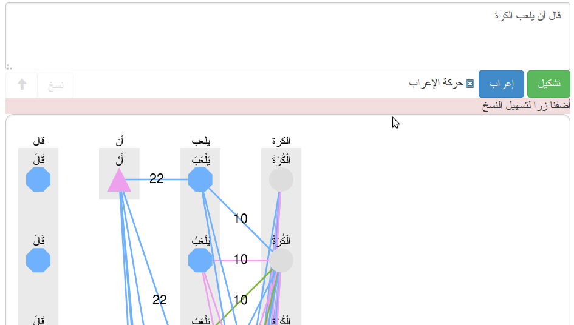

This repository is out of date, it's replaced by [Sylajone](https://github.com/linuxscout/sylajone-arabic-syntax)
# ثعلب: التحليل النحوي للنص العربية
## Thaalab-ArAnaSyn: Arabic Syntaxical Analysis 


التحليل النحوي للنص العربي
Syntaxical analysis For Arabic Texts


  Developpers:  Taha Zerrouki: http://tahadz.com
    taha dot zerrouki at gmail dot com

Features |   value
------------|-----------
Authors  | Taha Zerrouki: http://tahadz.com,  taha dot zerrouki at gmail dot com
Release  | 0.3
License  |[GPL](https://github.com/linuxscout/thaalab-aranasyn/master/LICENSE)
Tracker  |[linuxscout/thaalab-aranasyn/Issues](https://github.com/linuxscout/thaalab-aranasyn/issues)
Website  |[https://pypi.python.org/pypi/thaalab-aranasyn](https://pypi.python.org/pypi/thaalab-aranasyn)
Source  |[Github](http://github.com/linuxscout/thaalab-aranasyn)
Feedbacks  |[Comments](https://github.com/linuxscout/thaalab-aranasyn/issues)
Accounts  |[@Twitter](https://twitter.com/linuxscout)  [@Sourceforge](http://sourceforge.net/projects/thaalab-aranasyn/)

<!--Doc  |[package Documentaion](http://pythonhosted.org/thaalab-aranasyn/)-->
<!--Download  |[pypi.python.org](https://pypi.python.org/pypi/thaalab-aranasyn)-->


<!--
## Citation
If you would cite it in academic work, can you use this citation
```
T. Zerrouki‏, thaalab-aranasyn,  Arabic Word Tagger,
  https://pypi.python.org/pypi/thaalab-aranasyn/, 2018
```
or in bibtex format

```bibtex
@misc{zerrouki2012thaalab-aranasyn,
  title={thaalab-aranasyn : Arabic Word Tagger},
  author={Zerrouki, Taha},
  url={https://pypi.python.org/pypi/thaalab-aranasyn,
  year={2010}
}
```
-->

## مزايا
* ألتحليل النحوي
* الوسم النحوي
## Features
* Syntax analysis
* Word tagger 

Applications
====
* Text summarizing.
* Sentences identification.
* Grammar analysis.

تطبيقات 
====
* تلخيص النص.
* التعرف على الجمل.
* التحليل النحوي.


Demo جرّب
====
يمكن التجربة على [موقع مشكال](http://tahadz.com/mishkal)
، اختر أدوات > إعراب
You can test it on [Mishkal Site](http://tahadz.com/mishkal), choose: Tools > Inflextion




<!--
Installation
=====
```
pip install thaalab-aranasyn
```    
    -->
<!--
Usage
=====
```python
import thaalab-aranasyn.mynamed as mynamed
```
Example
=====
Test named entities
======
```python

```
-->


